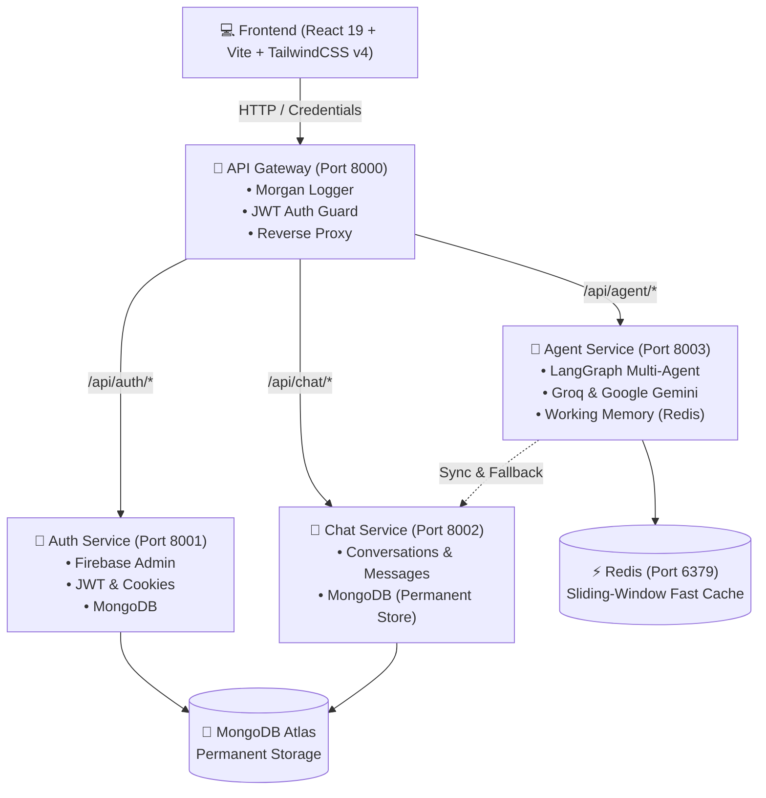

# 🧠 CortexAI - Multi-Agent AI Platform

A scalable, distributed, microservices-based Multi-Agent AI platform. CortexAI provides an intelligent conversational assistant capable of routing specialized queries (chat, coding, web search, PPT, PDF, vision) across multiple LLM providers (Groq, Google Gemini) with fast sliding-window memory powered by Redis and permanent conversation persistence backed by MongoDB.

---

## 🏗️ Architecture Overview

The system uses a decoupled microservices architecture coordinated through a centralized API Gateway:



---

## 🚀 Key Features

### 1. 🤖 LangGraph Multi-Agent System
* **Intelligent Routing:** A dedicated Router Agent classifies user intent and dispatches tasks to specialized nodes:
  * `chat` → General conversation, reasoning, explanations (Groq `gpt-oss-120b`).
  * `coding` → Software engineering, code generation, debugging (Google `gemini-2.5-pro`).
  * `search` → Real-time information and web search.
  * `ppt` → PowerPoint creation and editing.
  * `pdf` → Document summarization and analysis.
  * `vision` → Image and screenshot comprehension.

### 2. ⚡ Fast Sliding-Window Working Memory (Redis)
* **Sub-Millisecond Context Retrieval:** Past conversation turns are fetched from Redis in `< 1ms` before invoking LLMs.
* **Bounded Context Window:** Uses Redis lists (`RPUSH`, `LTRIM -20 -1`) to automatically cap history to the latest 20 turns, preventing context window bloat and runaway token costs.
* **Auto-Expiring TTL:** Redis keys expire after 24 hours of inactivity.
* **Dual-Layer Persistence:** MongoDB retains full permanent chat history via the Chat Service, with automatic Redis cache-warming on cache misses.

### 3. 🎨 Modern Frontend UX (CortexAI)
* **Lazy Conversation Creation:** New users and newly logged-in users start on a clean welcome screen (`currentConversation = null`). Conversations are automatically created only when the first prompt is sent.
* **Dynamic Title Updates:** Conversation titles automatically reflect the latest user prompt, moving active conversations to the top of the sidebar.
* **Refresh Persistence:** Active chats stay open across page reloads (F5) using `localStorage`.
* **Clean Logout:** Complete purge of user sessions, conversations, and message history across Redux slices on sign-out.

---

## 🛠️ Technology Stack

| Layer | Technologies |
| :--- | :--- |
| **Frontend** | React 19, Vite 8, Redux Toolkit, TailwindCSS v4, React-Markdown, Remark-GFM, Lucide / React Icons, Axios, Firebase SDK |
| **API Gateway** | Express 5, Express-HTTP-Proxy, Morgan, Cookie-Parser, CORS, JSON Web Tokens |
| **Auth Service** | Express 5, Firebase Admin SDK, MongoDB, Mongoose, JWT |
| **Chat Service** | Express 5, MongoDB, Mongoose |
| **Agent Service** | Express 5, LangChain Core, LangGraph 1.4, ChatGroq, Google GenAI SDK, ioredis |
| **Databases & Cache** | MongoDB Atlas, Redis (port 6379) |

---

## 📁 Project Structure

```text
MutiAI/
├── backend/
│   ├── gateway/                  # Central entry point & reverse proxy (Port 8000)
│   │   ├── controller/           # User resolution controllers
│   │   ├── middleware/           # JWT auth guard & verification
│   │   ├── utils/                # Proxy decorators (x-user-id forwarding)
│   │   └── index.js
│   │
│   └── services/
│       ├── auth/                 # Authentication service (Port 8001)
│       │   ├── config/           # Database & Firebase Admin initialization
│       │   ├── controllers/      # Login, logout, registration
│       │   ├── models/           # User schema
│       │   └── routes/           # Auth endpoints
│       │
│       ├── chat/                 # Chat persistence service (Port 8002)
│       │   ├── controllers/      # Conversations & messages CRUD
│       │   ├── models/           # Conversation & Message schemas
│       │   └── routes/           # Chat endpoints
│       │
│       └── agent/                # Multi-agent AI engine (Port 8003)
│           ├── agents/           # Specialized agent nodes (chat, coding, search, etc.)
│           ├── config/           # LLM models & ioredis memory setup
│           ├── controllers/      # Agent execution controller
│           ├── graph/            # LangGraph workflow, router, state annotations
│           ├── utils/            # Redis memory helpers (saveMessage, getMessages)
│           └── routes/           # Agent chat route
│
└── frontend/                     # React 19 SPA (Port 5173)
    ├── src/
    │   ├── api/                  # Axios instance with credentials
    │   ├── components/           # Dashboard, Sidebar, ChatArea, ArtifactPanel, Avatar
    │   ├── features/             # Async API services (login, chat, createConversation)
    │   ├── redux/                # Redux Toolkit slices (user, conversation, message)
    │   └── App.jsx
    └── pages/                    # Home / Landing & Authentication
```

---

## ⚙️ Environment Configuration

Create `.env` files in each service directory following these templates:

### 1. `backend/gateway/.env`
```env
PORT=8000
FRONTEND_URL="http://localhost:5173"
REDIS_URL="redis://localhost:6379"
AUTH_SERVICE=http://localhost:8001
CHAT_SERVICE=http://localhost:8002
AGENT_SERVICE=http://localhost:8003
```

### 2. `backend/services/auth/.env`
```env
PORT=8001
MONGO_URI="your_mongodb_connection_string/auth"
JWT_SECRET="your_jwt_secret_key"
```
*(Place your `serviceAccountKey.json` inside `backend/services/auth/` for Firebase Admin).*

### 3. `backend/services/chat/.env`
```env
PORT=8002
MONGO_URI="your_mongodb_connection_string/chat"
```

### 4. `backend/services/agent/.env`
```env
PORT=8003
MONGO_URI="your_mongodb_connection_string/agent"
REDIS_URL="redis://localhost:6379"
GROQ_API_KEY="your_groq_api_key"
GOOGLE_API_KEY="your_google_gemini_api_key"
CHAT_SERVICE="http://localhost:8002"
```

### 5. `frontend/.env`
```env
VITE_FIREBASE_API_KEY="your_firebase_web_api_key"
VITE_SERVER_URL=http://localhost:8000
```

---

## 🚦 Getting Started

### Prerequisites
* **Node.js**: v18+ installed
* **Redis**: Local server running on `localhost:6379` (or via Docker)
* **MongoDB**: Active MongoDB Atlas cluster or local instance

### 1. Start Redis
```bash
# Using Docker (recommended)
docker run -d -p 6379:6379 --name mutiai-redis redis:alpine

# Or verify local service
redis-cli ping
# Response should be PONG
```

### 2. Install Dependencies
Run `npm install` inside each component:
```bash
# Gateway
cd backend/gateway && npm install

# Auth Service
cd ../services/auth && npm install

# Chat Service
cd ../services/chat && npm install

# Agent Service
cd ../services/agent && npm install

# Frontend
cd ../../../frontend && npm install
```

### 3. Run Development Servers
Start all services in separate terminal tabs:

```bash
# Terminal 1: API Gateway
cd backend/gateway && npm run dev

# Terminal 2: Auth Service
cd backend/services/auth && npm run dev

# Terminal 3: Chat Service
cd backend/services/chat && npm run dev

# Terminal 4: Agent Service
cd backend/services/agent && npm run dev

# Terminal 5: Frontend
cd frontend && npm run dev
```

Visit **`http://localhost:5173`** to access CortexAI!

---

## 📡 API Endpoints (via Gateway Port 8000)

| Service | Method | Route | Description | Auth Required |
| :--- | :--- | :--- | :--- | :--- |
| **Gateway** | `GET` | `/` | Gateway healthcheck | No |
| **Auth** | `POST` | `/api/auth/login` | Login with Firebase credentials & issue cookie | No |
| **Auth** | `ALL` | `/api/auth/logout` | Clear auth cookies and invalidate session | No |
| **Auth** | `GET` | `/api/me` | Fetch authenticated user data | Yes |
| **Chat** | `POST` | `/api/chat/createConversation` | Create a new conversation | Yes |
| **Chat** | `GET` | `/api/chat/getConversation` | List user's conversation history | Yes |
| **Chat** | `PUT` | `/api/chat/updateConversation/:id` | Update conversation title | Yes |
| **Chat** | `GET` | `/api/chat/getMessage/:id` | Get messages for a specific conversation | Yes |
| **Chat** | `POST` | `/api/chat/saveMessage` | Persist a message | Yes |
| **Agent** | `POST` | `/api/agent/chat` | Send prompt to LangGraph agent with Redis context | Yes |

---

## 🔄 Conversation & Agent Execution Flow

```text
1. User enters prompt in ChatArea
2. If first message:
   └── Auto-create conversation with prompt title (POST /api/chat/createConversation)
   └── Set active ID in Redux and localStorage
3. Request sent to Gateway (POST /api/agent/chat)
4. Gateway checks auth cookie, decorates request with `x-user-id`, and proxies to Agent Service
5. Agent Controller:
   ├── Saves user message to MongoDB and pushes to Redis
   ├── Retrieves last 10 messages from Redis (sub-millisecond)
   └── Invokes LangGraph StateGraph
6. Router Agent classifies query -> passes execution to Chat Agent (Groq) or Coding Agent (Gemini)
7. Chat Agent injects system instructions + historical context + current prompt into LLM
8. Response returned:
   ├── Saved to Redis working memory
   ├── Saved to MongoDB permanent store
   └── Rendered in Markdown on the Frontend
9. Conversation title updates dynamically to the latest prompt in both UI and DB
```
